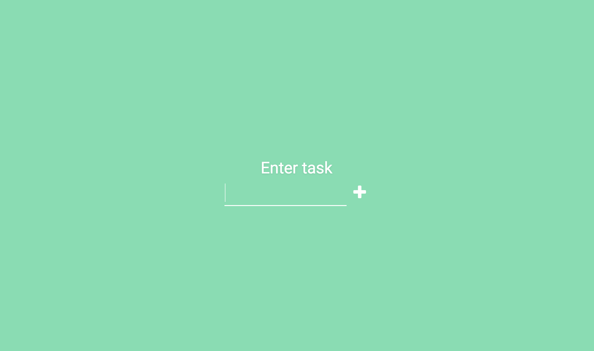
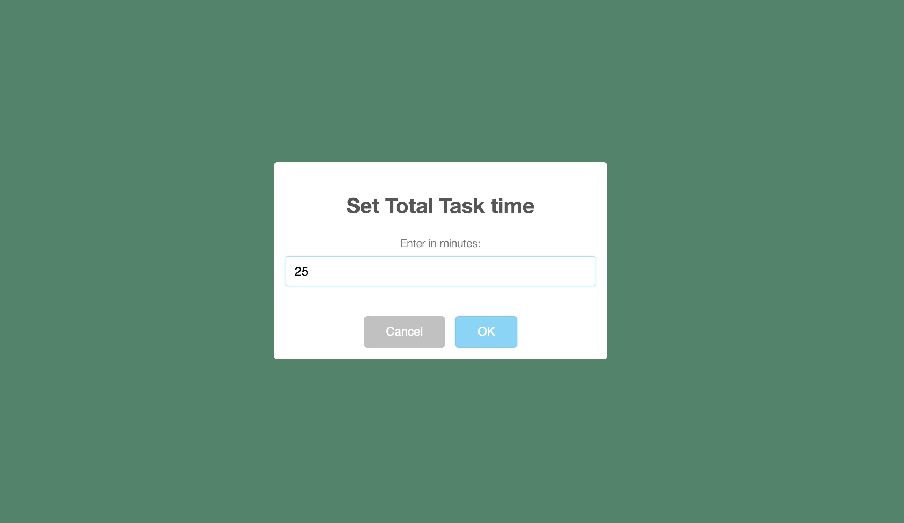
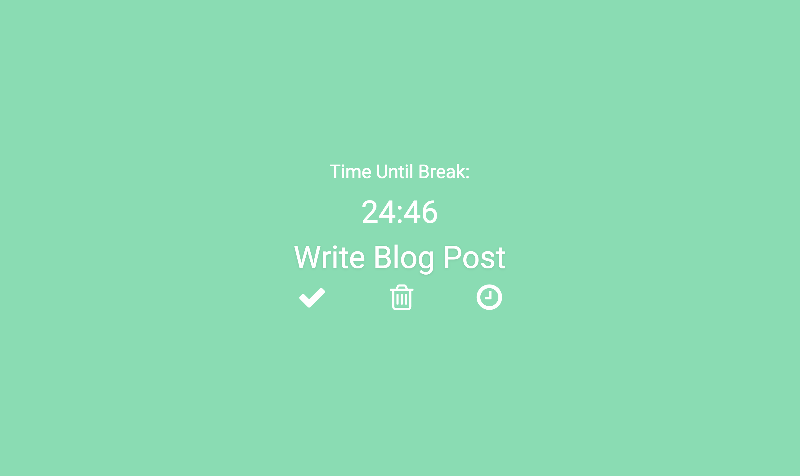
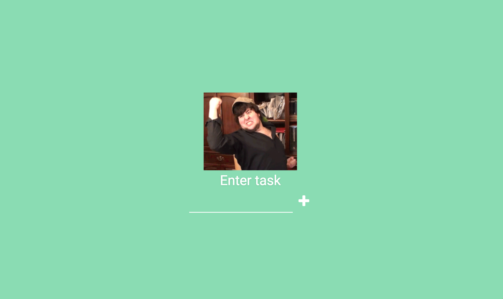

<h1>Focus Task App</h1>

Introduction - This app allows you to enter in a task and select a timer for how long the user would like to work on the task. You can delete a task or mark it complete. Once a task is marked complete a "success" Gif from the Giphy API will be displayed. If a task is deleted a "fail" Gif will be showed.

Why is this App Useful? - Focusing on one task is key to getting things done. Allowing the user to only work on one task maximizes productivity. The Gifs displayed are motivation to mark task complete so user sees a "success" Gif.

<h2>Technology used</h2>

The code used for this app is HTML, CSS, JavaScript, jQuery, Bootstrap, Sweet Alert, and the Giphy API. This app is responsive and will work on tablets and mobile devices for a consistent user experience.

